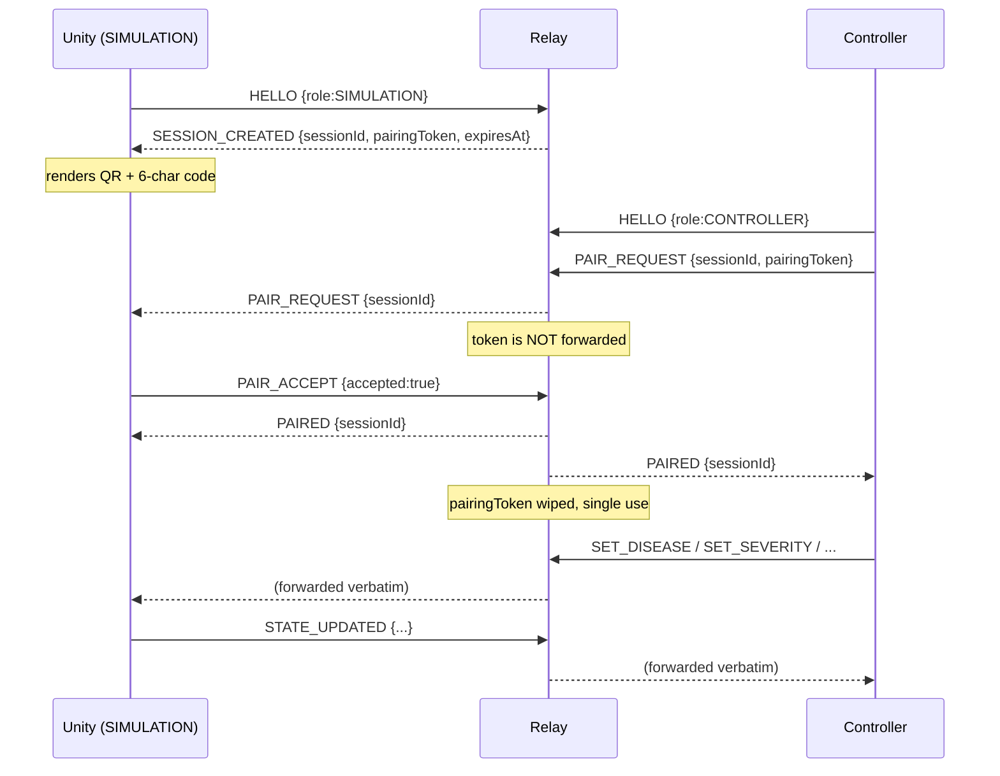

# VisionBridge relay protocol — command reference

**Protocol version: `1`**

`relay/src/protocol.ts` is the single source of truth. This document and
`protocol.schema.json` are both derived from it. If you need a new field or
command, it goes into `protocol.ts` first — then the controller and Unity
mirror it.

---

## Message envelope

Every message, in both directions, has the same four top-level fields plus a payload:

```json
{
  "v": 1,
  "type": "SET_SEVERITY",
  "seq": 42,
  "timestamp": 1787234105123,
  "payload": { "severity": 0.65 }
}
```

| Field | Type | Notes |
|---|---|---|
| `v` | `1` | Literal. Anything else is rejected — this is the version gate. |
| `type` | string | Must be one of the types below. Unknown types are rejected. |
| `seq` | non-negative int | Client-chosen. The relay echoes it back on responses so you can match a reply to a request. Not used for ordering or dedup by the relay. |
| `timestamp` | non-negative int | Unix ms. Informational only — the relay does not validate clock skew. |
| `payload` | object | Shape depends on `type`. Commands with no data take `{}` or may omit the key. |

**Hard limits:** messages over **8 KB** are rejected (`message_too_large`), and each
connection may send at most **20 messages per second** (`rate_limited`).

---

## Roles

Two roles exist, declared in `HELLO`:

- **`SIMULATION`** — the Unity app on the phone in the headset. **Creates** the session and is **authoritative** over simulation state.
- **`CONTROLLER`** — the doctor's React Native app. **Joins** an existing session and *requests* changes.

The relay enforces which role may originate which message type. A controller
cannot fabricate a `STATE_UPDATED`, and a simulation device cannot issue commands
to itself.

---

## Connection lifecycle



Key asymmetry: **only a `SIMULATION` HELLO creates a room.** A `CONTROLLER`
HELLO does nothing but tag the connection's role — the controller must follow up
with `PAIR_REQUEST`.

### Session lifetimes

| Timer | Value | Behaviour |
|---|---|---|
| Unpaired TTL | 2 min | A session nobody pairs to is destroyed. `expiresAt` in `SESSION_CREATED` is this deadline. |
| Inactivity TTL | 30 min | A paired but silent room is destroyed. Send `PING` to keep it alive. |
| Heartbeat | 15 s | The relay pings every socket; one that fails to pong is terminated. |

---

## Handshake messages

### `HELLO` — either role, first message

```json
{ "v":1, "type":"HELLO", "seq":0, "timestamp":0, "payload": { "role": "SIMULATION" } }
```

`role` is `"SIMULATION"` or `"CONTROLLER"`.

- From `SIMULATION`: creates a room, replies `SESSION_CREATED`.
- From `CONTROLLER`: records the role, sends nothing back.

### `PAIR_REQUEST` — controller to relay to simulation

```json
{ "v":1, "type":"PAIR_REQUEST", "seq":1, "timestamp":0,
  "payload": { "sessionId": "K7P4QX", "pairingToken": "one-time-random-token" } }
```

`sessionId` is exactly 6 chars; `pairingToken` is 16–128 chars.

The relay checks, in order: session exists, not already paired, no other device
pending, token matches, pairing window still open. On success it forwards to
Unity **with the token stripped**:

```json
{ "v":1, "type":"PAIR_REQUEST", "seq":1, "timestamp":0, "payload": { "sessionId": "K7P4QX" } }
```

### `PAIR_ACCEPT` — simulation only

```json
{ "v":1, "type":"PAIR_ACCEPT", "seq":2, "timestamp":0, "payload": { "accepted": true } }
```

- `accepted: true` — both sides receive `PAIRED`, and the pairing token is
  immediately invalidated so the QR code cannot be replayed.
- `accepted: false` — the pending controller receives `ERROR {code:"pair_rejected"}`
  and **the entire room is destroyed**. The controller must obtain a *fresh*
  session code; retrying the old one will fail with `session_not_found`.

---

## Simulation commands

All of these are **controller-only** and are forwarded verbatim to Unity once
paired. The relay validates their shape but never inspects or rewrites the
payload — it holds no simulation state.

| Type | Payload | Meaning |
|---|---|---|
| `SET_DISEASE` | `{ "disease": DiseaseEnum }` | Select which condition or symptom to simulate, including central scotoma, RD flash, curtain sign, and red floaters. |
| `SET_SEVERITY` | `{ "severity": 0.0 to 1.0 }` | Intensity. Values outside 0–1 are rejected, not clamped. |
| `SET_COMPARISON` | `{ "comparison": "NORMAL" or "AFFECTED" }` | Toggle between unaffected and affected vision. |
| `START_PROGRESSION` | `{ "durationSeconds": >0 and <=600 }` | Ramp severity of the current `SET_DISEASE` effect over this many seconds. |
| `START_DISEASE_SIMULATION` | `{ "program": DiseaseProgramEnum, "durationSeconds": >0 and <=600 }` | Play a scripted multi-symptom program from `t=0`. Re-sending restarts it. |
| `PAUSE_PROGRESSION` | `{ "paused": bool }` | Halt an in-flight run in place, or resume it. |
| `SET_SCENE` | `{ "scene": "GARDEN" or "HOSPITAL" }` | Switches the background environment scene. Independent of the disease/symptom effect, which carries over across the switch. |
| `RECENTER` | `{}` | Reset head-tracking forward direction. |
| `RESET` | `{}` | Return to normal vision, severity 0. |
| `END_SESSION` | `{}` | Ends the session; the relay closes both sockets with code `1000`. |

### `STATE_UPDATED` — simulation only

```json
{ "v":1, "type":"STATE_UPDATED", "seq":42, "timestamp":0,
  "payload": { "disease":"TUNNEL_VISION", "severity":0.65,
               "comparison":"AFFECTED", "scene":"GARDEN" } }
```

Unity is authoritative. The controller must treat its own commands as *requests*
and render the UI from the most recent `STATE_UPDATED`, not from optimistic local
state. Echo the originating `seq` so the controller can correlate.

### `PING` — either role

```json
{ "v":1, "type":"PING", "seq":99, "timestamp":0, "payload": {} }
```

Resets the 30-minute inactivity timer. **Never forwarded to the peer** and
produces no reply. This is separate from the relay's own WebSocket-level
ping/pong heartbeat, which your client library answers automatically.

---

## Relay-originated messages

These are only ever *sent by* the relay. Clients must not send them — doing so
is rejected as an unknown type.

### `SESSION_CREATED`

```json
{ "v":1, "type":"SESSION_CREATED", "seq":0, "timestamp":0,
  "payload": { "sessionId":"K7P4QX", "pairingToken":"...", "expiresAt":1787234400000 } }
```

`sessionId` is drawn from `ABCDEFGHJKLMNPQRSTUVWXYZ23456789` — no `0`, `O`, `1`
or `I`, so the fallback code cannot be misread. `expiresAt` is Unix ms.

### `PAIRED`

```json
{ "v":1, "type":"PAIRED", "seq":2, "timestamp":0, "payload": { "sessionId":"K7P4QX" } }
```

### `ERROR`

```json
{ "v":1, "type":"ERROR", "seq":1, "timestamp":0,
  "payload": { "code":"invalid_token", "message":"pairing token mismatch" } }
```

`seq` is the sequence number of the message that caused the error, or `0` if the
relay could not parse one. An `ERROR` never closes the connection by itself.

| `code` | Cause |
|---|---|
| `invalid_json` | Body was not parseable JSON. |
| `invalid_message` | Failed schema validation (unknown type, bad field, out-of-range value). `message` names the offending path. |
| `message_too_large` | Over 8 KB. |
| `rate_limited` | Over 20 messages/second on this connection. |
| `session_not_found` | No such session, or it already expired. |
| `session_already_paired` | A controller is already connected to that session. |
| `pairing_in_progress` | Another device is already awaiting confirmation. |
| `invalid_token` | Pairing token mismatch — includes replaying an already-used token. |
| `session_expired` | The 2-minute pairing window closed. The room is destroyed. |
| `pair_rejected` | The simulation device declined the pairing request. |
| `no_pending_pair` | `PAIR_ACCEPT` arrived with no pending request. |
| `not_paired` | A command was sent before pairing completed. |
| `forbidden` | The sender's role may not originate that message type. |

---

## Disconnect and reconnect

If either paired device disconnects, the relay sends the survivor a synthetic
`END_SESSION` (with `seq: 0`) and destroys the room. Unity must treat this as
"control lost" and **return to normal vision**.

Rooms are held in memory only. A relay restart drops every session, and both
devices must pair again from a fresh code. There is currently no session
resumption — a dropped controller cannot rejoin an existing room, because the
pairing token was invalidated at pair time.

---

## Client implementation checklist

- Send `HELLO` as the very first message on the socket.
- Clamp `severity` to 0–1 **before** sending; the relay rejects rather than clamps.
- Throttle continuous controls (severity sliders) to ~10–15 msg/s, well under the
  20/s limit, and always send the final value on release.
- Treat `STATE_UPDATED` as the truth for UI rendering.
- Handle `ERROR` without tearing down the connection.
- Send `PING` every few minutes on an otherwise idle session.
- On `END_SESSION`, reset to a safe state — for Unity that means normal vision.
- Never log or display the `pairingToken`.
